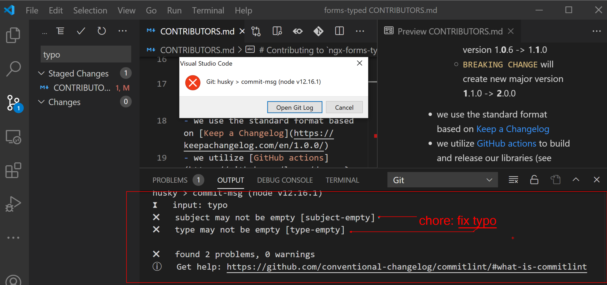

# Contributing to `ngx-forms-typed` and `ngx-show-form-control`

Hi, and thanks for your interest!

There are 2 libraries living in this repo:
- `ngx-forms-typed` - /projects/forms
- `ngx-show-form-control` - /projects/show-form-control

And there's also an example app that lives in /src folder.

## Setup
We are using a couple of libraries to setup our process of contributing:
- [husky](https://www.npmjs.com/package/husky) - will run a pre-commit step to verify that the commit message adheres to [Angular standard commit](https://github.com/angular/angular/blob/master/CONTRIBUTING.md#-commit-message-format)
- [semantic-release](https://semantic-release.gitbook.io/semantic-release/) takes care of release based on the commits - check out [their great docs](https://github.com/semantic-release/semantic-release#commit-message-format) but in short
   - `fix` will create new patch version 1.0.**5** -> 1.0.**6**
   - `feat` will create new minor version 1.**0**.6 -> 1.**1**.0
   - `BREAKING CHANGE` will create new major version **1**.1.0 -> **2**.0.0
- we use the standard format based on [Keep a Changelog](https://keepachangelog.com/en/1.0.0/)
- we utilize [GitHub actions](https://github.com/learn/devops?utm_source=google&utm_medium=ppc&utm_campaign=devops_campaign_q1_IDCreport_EMEA_ggl&utm_content=version1&gclid=EAIaIQobChMIpoTztYj46wIVRubtCh2kEgn9EAAYASAAEgIPNvD_BwE#idcreport) to build and release our libraries (see `.github/workflows/release-forms-typed.yml`, etc.)

## Crafting a PR
 All of the above means that when preparing your PR you'll have to:
  - adhere to the commit standard (and we have a pre-commit step that will fail your commit if you don't)
  - add a line to the project's `Changelog.md` (this is not automated)
  - add a test or two for your change
    - `ngx-forms-typed` - /projects/forms/src/lib/forms-typed.tests.ts
    - `ngx-show-form-control` - /projects/show-form-control/src/lib/show-form-control/show-form-control.component.spec.ts

## Recipies
Look into the following to make sense on the release process
 - semantic release - [publish recipe](https://github.com/semantic-release/semantic-release/blob/1405b94296059c0c6878fb8b626e2c5da9317632/docs/recipes/distribution-channels.md)

## Error example

This is what an error looks like in the console and in the VS Code (on Windows). An acceptable message would be `chore:fix typo`
