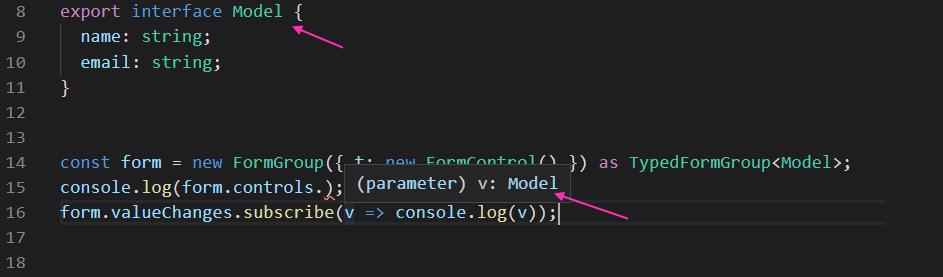
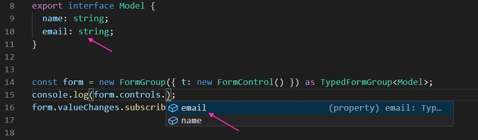
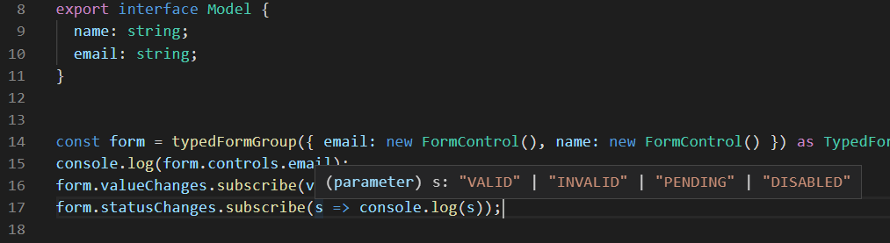

# FormsTyped
This project aims at providing several tools for Angular Forms development, including: 
 - types for strongly typing your `FormControl`s, `FormGroup`s and `FormArray`s based on a Model type
 - functions for instantiating the `TypedFormControl`, `TypedFormGroup` and `TypedFormArray` based on a Model type
 - a helper function that enumerates all controls in a form (group) 
     - calls methods on each of them
     - attaches their validators to a paren form (group) 
     - attaches the touched/untouched behavior to a paren form (group)
 - a helper component that shows the form/group/control and allows for editing of the value emitted 

## Manually applying strong types to existing forms 

Example shows adding the strong type to an existing form control and its value is now **strong typed**!

 
The controls property is now **strong typed**!

Note: The parameters for the `FormControl` are **not strong typed**. Notice we are passing the `t` as a FormControl and then are trying to access `email`. Hence the `typedFormGroup` function. See [below](#Using-the-helper-functions-to-strong-type-forms)

## Using the helper functions to strong type forms

Using the function, now the parameters passed in are also **strong typed**!

And the `setValue` (`patchValue` also) method(s)

And the status changed

## Using the helper function to touch all controls in a form
A function allowing easy and type-safe interacting with each form control in a form:

Will iterate over all controls in a form group or form array and call the `markAsTouched` method on them

Type safe:

Multiple methods as params supported:

### Interaction in parent-child form scenarios:

Here we want the validation of the child `Address` form to influence the parent `Person` form. That's the `addValidatorsTo()` method's job. We also want to make the child form touched if we call the parent form `touch()` method. That's the `markAsTouchedSimultaneouslyWith()` method's job. For more details and how they interact see example implementation:
 - [parent component](src/app/party-form/party-form.component.ts) 
 - [child form](src/app/person-contact/person-contact.component.ts) 
 - [control calue accessor connector](src/app/shared/control-value-accessor-connector.ts)

## CLI 
This project was generated with [Angular CLI](https://github.com/angular/angular-cli) version 9.0.3.

## Library build 

Run `ng build forms` or `ng build forms --prod` to build the library and run the [development server](#Development-server) to start the example project

## Development server

Run `ng serve` for a dev server. Navigate to `http://localhost:4200/`. The app will automatically reload if you change any of the source files.

## Code scaffolding

Run `ng generate component component-name` to generate a new component. You can also use `ng generate directive|pipe|service|class|guard|interface|enum|module`.

## Build

Run `ng build` to build the example project. The build artifacts will be stored in the `dist/` directory. Use the `--prod` flag for a production build.

## Running unit tests

Run `ng test` to execute the unit tests via [Karma](https://karma-runner.github.io).

## Running end-to-end tests

Run `ng e2e` to execute the end-to-end tests via [Protractor](http://www.protractortest.org/).

## Further help

To get more help on the Angular CLI use `ng help` or go check out the [Angular CLI README](https://github.com/angular/angular-cli/blob/master/README.md).
