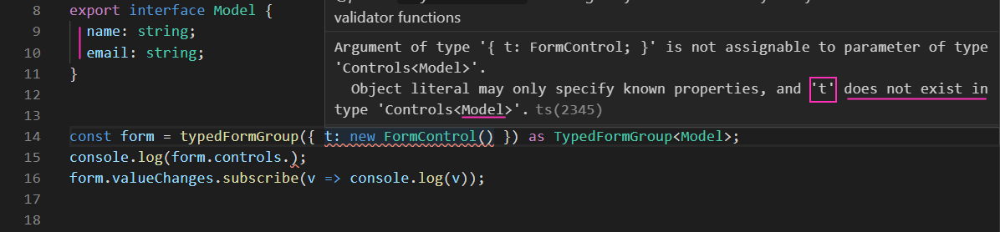
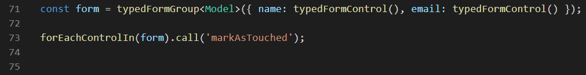
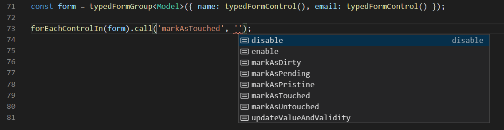
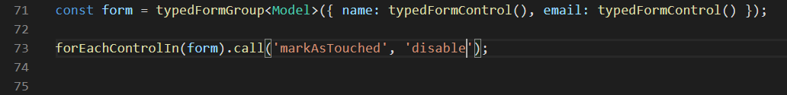
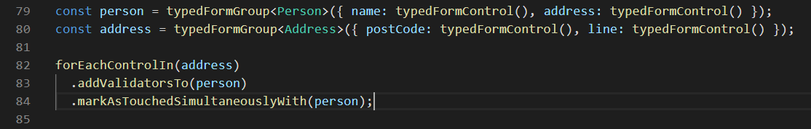

# Forms Typed (ngx-forms-typed)
This project aims at providing several tools for Angular Forms development, including: 
 - types for strongly typing your `FormControl`s, `FormGroup`s and `FormArray`s based on a Model type
 - functions for instantiating the `TypedFormControl`, `TypedFormGroup` and `TypedFormArray` based on a Model type
 - a helper function that enumerates all controls in a form (group) 
     - calls methods on each of them
     - attaches their validators to a parent form (group) 
     - attaches the touched/untouched behavior to a parent form (group)
 - a helper component that shows the form/group/control and allows for editing of the value emitted 
 
## Getting started

1. `npm install --save-dev ngx-forms-typed` 
2. Create a model for your form (see [example](/src/app/person-contact/person-contact.model.ts))
3. Inherit `ControlValueAccessorConnector` (see [example](/src/app/person-contact/person-contact.component.ts))
4. Enjoy your type safety!
 
## Features

## Manually applying strong types to existing forms 

Example shows adding the strong type to an existing form control and its value is now **strong typed**!

 
The controls property is now **strong typed**!

Note: The parameters for the `FormControl` are **not strong typed**. Notice we are passing the `t` as a FormControl and then are trying to access `email`. Hence the `typedFormGroup` function. See [below](#Using-the-helper-functions-to-strong-type-forms)

## Using the helper functions to strong type forms

Using the function, now the parameters passed in are also **strong typed**!

And the `setValue` (`patchValue` also) method(s)

And the status changed

## Using the helper function to touch all controls in a form
A function allowing easy and type-safe interacting with each form control in a form:

Will iterate over all controls in a form group or form array and call the `markAsTouched` method on them

Type safe:

Multiple methods as params supported:

### Interaction in parent-child form scenarios:

Here we want the validation of the child `Address` form to influence the parent `Person` form. That's the `addValidatorsTo()` method's job. We also want to make the child form touched if we call the parent form `touch()` method. That's the `markAsTouchedSimultaneouslyWith()` method's job. For more details and how they interact see example implementation:
 - [parent component](src/app/party-form/party-form.component.ts) 
 - [child form](src/app/person-contact/person-contact.component.ts) 
 - [control value accessor connector](src/app/shared/control-value-accessor-connector.ts)

## Limitations
- It requires injecting NgControl. Like [so](https://github.com/gparlakov/forms-typed/blob/21e99c91877746b506dd64ad0e5a127eeed15bac/src/app/person-contact/person-contact.component.ts#L13)
- It requires calling super.ngOnInit from the child ngOnInit. Like [so](https://github.com/gparlakov/forms-typed/blob/21e99c91877746b506dd64ad0e5a127eeed15bac/src/app/person-contact/person-contact.component.ts#L24)
- At present .get('name') is not strongly typed - could be if users want it
- All properties of a model need to have corresponding controls in a FormGroup modeled with a type. That means that Typescript will yell at you if you don't give it a FormControl for each and every property in the model. It's a restriction that's there by design, although I can see how it would sadden someone reusing the model for other things and can break their forms.
- FormGroup inherited limitation: value on an enabled FormGroup would include only enabled fields in that FormGroup - which is what you may or may not want. See [source](https://github.com/angular/angular/blob/master/packages/forms/src/model.ts#L1570-L1579).

## ngx-forms-typed for enterprise

Available as part of the Tidelift Subscription.

The maintainers of ngx-forms-typed and thousands of other packages are working with Tidelift to deliver commercial support and maintenance for the open source dependencies you use to build your applications. Save time, reduce risk, and improve code health, while paying the maintainers of the exact dependencies you use. [Learn more.](https://tidelift.com/subscription/pkg/npm-ngx-forms-typed?utm_source=npm-ngx-forms-typed&utm_medium=referral&utm_campaign=readme)
