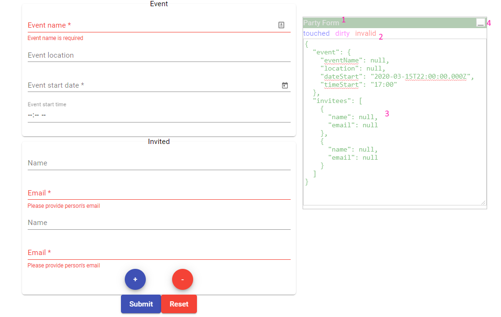

# ShowFormControl

This is a component that visualizes an `AbstractControl` instance - `FormControl`, `FormGroup`, `FormArray`.
Visualization looks like this

1. **Named** and **draggable** window!
2. **Status** - dirty/pristine, touched/untouched, valid/invalid/pending/disabled
3. **Value** `JSON.stringify`-ed. **Editable** - edited value appears in form!
4. **Minify** and **Maximize**
And MORE...
* **Resizable** (see bottom right corner)
* **Multiple instances** supported
* **Only** included in **dev builds**! You can use it rest assured - it will **not** end up **showing** in **production**! Just import it in you app.module (or feature module):
    ```ts
        ShowFormControlModule.for(environment.production? 'prod' : 'dev')
    ```

## See it in Action

This library was generated with [Angular CLI](https://github.com/angular/angular-cli) version 9.0.2.

## Code scaffolding

Run `ng generate component component-name --project show-form-control` to generate a new component. You can also use `ng generate directive|pipe|service|class|guard|interface|enum|module --project show-form-control`.
> Note: Don't forget to add `--project show-form-control` or else it will be added to the default project in your `angular.json` file.

## Build

Run `ng build show-form-control` to build the project. The build artifacts will be stored in the `dist/` directory.

## Publishing

After building your library with `ng build show-form-control`, go to the dist folder `cd dist/show-form-control` and run `npm publish`.

## Running unit tests

Run `ng test show-form-control` to execute the unit tests via [Karma](https://karma-runner.github.io).

## Further help

To get more help on the Angular CLI use `ng help` or go check out the [Angular CLI README](https://github.com/angular/angular-cli/blob/master/README.md).
